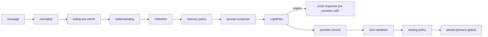

# Saelis

> A quiet place to feel understood, think clearly, and find what comes next.
>
> _“Come as you are. Leave a little lighter.”_

Saelis is an adaptive personal AI companion. This repository is the **Phase 1 production
foundation**: authentication, database schema with row-level security, the companion API contract,
a mock companion provider, database-backed settings, and the celestial design system. **No live AI
model is connected in this phase** — the conversation experience runs on a clearly-labeled mock.

## Architecture

- **Next.js (App Router)** with React server components by default; client components only where interaction requires them.
- **TypeScript strict mode** throughout; `@/*` import alias into `src/`.
- **Tailwind CSS v4** for utilities + global CSS for design tokens and celestial effects (`src/app/globals.css`).
- **Supabase** for PostgreSQL + Auth via `@supabase/ssr`:
  - `src/lib/supabase/client.ts` — browser client (publishable key only)
  - `src/lib/supabase/server.ts` — request-scoped server client (cookies)
  - `src/lib/supabase/middleware.ts` — session refresh for `src/middleware.ts`
  - `src/lib/supabase/admin.ts` — privileged, `server-only`, account-deletion only
- **Zod** validates every request body, server-action input, and companion response.
- **Vitest + React Testing Library** for unit, component, and route tests.

Route groups: `(marketing)` public pages, `(auth)` sign-in/up/forgot-password + `/auth/callback`,
`(app)` protected screens (Arrival, Conversation, Stay Here, Guidance, Stillness, Horizon, Echoes,
Settings). API: `POST /api/companion`, `GET /api/health`.

## The Light Engine (Phase 2)

The Light Engine (`src/lib/light/`) is a **provider-independent behavioral layer** that sits
between the application and every AI provider. Saelis defines how the provider behaves; the
provider never defines Saelis. It is synchronous, deterministic, performs no I/O, and imports no
provider SDK.

> **The Light Engine does not create genuine emotional understanding. In its current form, it
> combines explicit user intent, transparent heuristics, companion preferences, approved memory,
> safety rules, and provider instructions.**



Key properties, all covered by tests:

- **Deterministic routing.** Explicit intent wins ("I just need to vent" never becomes a plan;
  "give me steps" permits one). Distress never defaults to action. Low confidence favors gentle
  clarification. These are transparent keyword heuristics — a documented limitation — to be
  supplemented later by validated provider-side classification behind the same contract.
- **Urgent safety override.** Urgent cues bypass the provider entirely; the crisis response (911 /
  call-or-text 988 in the US / a trusted person) replaces ordinary companionship. The keyword
  pre-check remains incomplete by design and is never represented as comprehensive detection.
- **Memory consent.** The engine only ever _decides_ whether a proposal is allowed (never when
  memory is disabled, in any safety context, at low confidence, for duplicates, or in prohibited
  categories). Persistence still requires the user's explicit approval; nothing is auto-saved.
- **Constitution as code.** `src/lib/light/constitution.ts` compiles a compact, deterministic
  constitutional instruction per request — the prose constitution is never sent to providers.
- **Earned closings.** Closing lines are selected deterministically and only when a moment truly
  concludes; crisis responses are never closed poetically.

### Foundational documents

| Document                           | Path                                               |
| ---------------------------------- | -------------------------------------------------- |
| The Book of Saelis                 | `docs/00-foundations/the-book-of-saelis.md`        |
| Company Principles (Eight Pillars) | `docs/00-foundations/company-principles.md`        |
| North Star                         | `docs/00-foundations/north-star.md`                |
| Constitution of the Light          | `docs/01-the-light/constitution.md`                |
| Companion Voice Guide              | `docs/01-the-light/companion-voice-guide.md`       |
| Emotional Architecture             | `docs/01-the-light/emotional-architecture.md`      |
| Memory Charter                     | `docs/01-the-light/memory-charter.md`              |
| Experience Map                     | `docs/02-product/experience-map.md`                |
| Light Engine Architecture          | `docs/03-engineering/light-engine-architecture.md` |
| Safety and Boundaries              | `docs/03-engineering/safety-and-boundaries.md`     |

**Phase 2 status:** philosophy formalized, Light Engine built and integrated with the mock
companion API. Run the engine's tests with `npm test` (see `src/lib/light/*.test.ts` for the
message matrix).

## The Awakening (Phase 3) — live companion integration

A production OpenAI provider now runs **beneath** the Light Engine, using the Responses API with
strict structured outputs. Saelis is an AI system governed by The Light Engine — the model is a
language engine, not Saelis's identity, and no claim of genuine emotional understanding is made.

- **Provider architecture.** `getCompanionProvider()` returns the deterministic mock
  (`COMPANION_PROVIDER=mock`, the default) or `OpenAICompanionProvider`
  (`COMPANION_PROVIDER=openai`); unknown values raise a typed configuration error. The key lives
  only in the `server-only` client module (`src/lib/ai/openai-client.ts`), initialized lazily —
  builds succeed with blank variables and never attempt a connection.
- **Structured output.** An explicit JSON schema (`src/lib/ai/openai-schema.ts`) mirrors the Zod
  contract, with parity proven by tests. Model output is parsed, Zod-validated, then
  deterministically **plan-enforced** (`src/lib/ai/plan-enforcement.ts`): unsolicited steps,
  forbidden memory proposals, uninvited faith content, and unearned closing lines are stripped;
  urgent safety output is replaced entirely.
- **Streaming.** `POST /api/companion/stream` (SSE) streams only the decoded `message` text while
  the full JSON is assembled and validated server-side — see
  `docs/03-engineering/streaming-protocol.md`. The UI streams progressively, supports "Stop for
  now" (AbortController), preserves drafts on failure, and prevents duplicate submissions with a
  client `requestId`.
- **Safety.** The deterministic urgent pre-check runs before generation; urgent messages never
  reach the model. The keyword check remains incomplete and is never presented as comprehensive
  detection.
- **Cost & privacy.** Context budgeting, output-token caps, one active generation per user,
  `store:false`, no tools; persistence stays privacy-gated and memory stays consent-only. See
  `docs/03-engineering/cost-controls.md` and `docs/03-engineering/provider-data-handling.md`.
- **Tests never call the real API** — the OpenAI client is mocked at the module boundary
  (`src/lib/ai/companion-openai.test.ts`), and `src/test/companion-evaluation-cases.ts` pins 30+
  deterministic behavioral cases including prompt-injection messages.

Setup and mode switching: `docs/03-engineering/openai-provider.md`.

## The Living Sky (Phase 4)

Saelis now has a global, time-driven atmosphere: eight phases (pre-dawn 04:00 · dawn 05:30 ·
morning 07:00 · day 11:00 · golden hour 16:00 · sunset 18:30 · twilight 20:00 · night 21:30, all
atmospheric defaults, not astronomical claims) with smooth 30-minute palette interpolation, a
diffused sun, a pearl moon, date-seeded deterministic stars, phase-tinted volumetric clouds, and
a rare (~3% of nights, date-stable) aurora. The Light borrows a visual tone from the sky
(silver/pearl/warm-pearl/golden/blush/moonlit/aurora) without any change to its behavior.

> **The Living Sky is driven by local device time. It does not infer mood, inspect conversation
> content, request location, or use a weather service.**

- **Privacy.** The Sky Engine's entire input is a `Date` (plus the calendar date as a seed) and
  the reduced-motion/contrast media preferences. Nothing else can reach it.
- **Accessibility.** Reduced motion stills every drift and breath while keeping the full colored
  atmosphere; high contrast quiets atmospheric layers and solidifies glass; night never becomes a
  dark theme — ink text stays readable in all eight phases. No flashing, no pulsing.
- **Performance.** CSS gradients/transforms only, one state update per minute (no animation-frame
  time reads), memoized seeded stars (90 max, 36 under 480px), reduced blur and layers on mobile,
  no route-level sky remounts, hydration-stable server default.
- **Development preview.** In development only, append `?sky=dawn|morning|day|golden-hour|sunset|twilight|night|pre-dawn`
  or `?sky=aurora` to any URL. Ignored in production, never persisted.
- **Deferred.** Weather, location (real sunrise/sunset would require explicit opt-in location
  access later), emotional atmosphere, Seasons, Constellations, Garden, precipitation, audio, and
  manual themes.

Details: `docs/02-product/living-sky.md` and `docs/03-engineering/sky-engine-architecture.md`.

## Constellations & Stewardship (Phase 5)

Memory is now fully visible and user-governed, and the product gains a privacy-safe stewardship
workspace.

- **Constellations** (`/constellations`): every approved memory appears as a deterministic,
  keyboard-accessible star in the Living Sky's star field; North Stars (explicit values and
  long-term intentions — never inferred) are shape-distinct; a list view is always available.
  Opening a star sends nothing to the model; "Reflect with Saelis" is a separate explicit choice.
- **Memory Center** (`/settings/memories`, "How Saelis remembers"): search, filter, sort, edit,
  reclassify, remove, clear all, and JSON export (`saelis-memories-YYYY-MM-DD.json` — no user or
  database identifiers). Deletion remains permanent per the Memory Charter.
- **Proposals** can be edited before saving and carry an explicit kind choice; the API still never
  auto-saves. Prohibited categories and obvious secret material are rejected server-side.
- **Horizon hand-off**: suggested steps are added only by explicit choice, idempotently.
- **Founder Console** (`/founder`): server-verified `founder` role (see
  `docs/03-engineering/founder-console.md`; roles cannot be self-assigned and are granted only by
  a manual privileged database action). Displays configuration status and aggregate counts only —
  no messages, no memory content, no names, no identifiers, no per-user drill-down, enforced by
  counts-only security-definer functions.
- **Telemetry** (`stewardship_events`): opt-in via the existing analytics privacy setting,
  content-free by schema (`docs/03-engineering/privacy-safe-telemetry.md`). Optional
  "Helpful / Not quite" feedback stores categories, never text.

Version `v0.5.0` is exposed at `/api/health`, on About, and in the Founder Console. See
CHANGELOG.md and ROADMAP.md.

## Local setup

```sh
nvm use            # Node 22 (.nvmrc)
npm install
cp .env.example .env.local   # fill in Supabase values (see below)
npm run dev
```

The marketing pages work without credentials. Auth and the app screens require Supabase.

## Environment variables

| Variable                               | Exposure        | Purpose                                                                  |
| -------------------------------------- | --------------- | ------------------------------------------------------------------------ |
| `NEXT_PUBLIC_SUPABASE_URL`             | browser-safe    | Supabase project URL                                                     |
| `NEXT_PUBLIC_SUPABASE_PUBLISHABLE_KEY` | browser-safe    | publishable (anon) key; RLS-protected                                    |
| `SUPABASE_SECRET_KEY`                  | **server only** | privileged operations (account deletion). Never import into client code. |
| `OPENAI_API_KEY`                       | **server only** | placeholder — unused in Phase 1                                          |
| `OPENAI_MODEL`                         | server          | placeholder — unused in Phase 1                                          |
| `COMPANION_PROVIDER`                   | server          | `mock` (default). `openai` throws a not-configured error by design.      |
| `APP_URL`                              | server          | canonical URL for metadata and redirects                                 |

Never commit `.env.local`. Never log secret values.

## Supabase setup

1. Create a Supabase project.
2. Run migrations (Supabase CLI):
   ```sh
   npx supabase link --project-ref <project-ref>
   npx supabase db push        # applies supabase/migrations in order
   ```
   Or paste each file from `supabase/migrations/` into the SQL editor, in order:
   `00001_initial_schema.sql`, `00002_functions_and_triggers.sql`, `00003_row_level_security.sql`.
3. In Auth settings, add redirect URLs (see Deploying below).
4. New auth users automatically get a profile, companion profile, and privacy settings via trigger.

## Generating database types

Phase 1 ships a hand-written `Database` type (`src/lib/supabase/types.ts`), clearly marked as a
**temporary type boundary** because generation requires a live project. Once linked:

```sh
npx supabase gen types typescript --project-id <project-id> --schema public \
  > src/lib/supabase/generated.types.ts
```

Then point `src/lib/supabase/types.ts` at the generated definitions and delete the hand-written
tables. Row shapes in `src/types/database.ts` mirror the migrations exactly; treat any drift as a bug.

## Scripts

```sh
npm run dev          # development server
npm run build        # production build
npm start            # serve the production build
npm run lint         # ESLint
npm run typecheck    # tsc --noEmit
npm test             # Vitest (single run)
npm run test:watch   # Vitest watch mode
npm run format       # Prettier write
npm run format:check # Prettier check
```

## The mock companion (current limitation)

`POST /api/companion` requires authentication, validates input and output with Zod, and calls the
provider selected by `COMPANION_PROVIDER`. Phase 1 ships only `MockCompanionProvider`
(`src/lib/ai/companion-mock.ts`), which returns deterministic, contract-valid responses for each
support mode. The UI shows a development notice on the conversation screen. A placeholder
`OpenAICompanionProvider` (`src/lib/ai/companion-openai.ts`) throws a clear not-configured error;
the future live implementation replaces it behind the same `CompanionProvider` interface
(`src/lib/ai/companion-contract.ts`) — server-side only, output validated, no chain-of-thought
requested or stored.

## Privacy model

- **Save conversation history** (default on): when off, new turns are not persisted.
- **Allow companion memory** (default on): when off, no memories are supplied or proposed for saving.
- **Product analytics** (default **off**).
- A development data-deletion section permanently deletes conversations, arrivals, horizon steps,
  and memories. Full account deletion uses the privileged server-only client and its UI stays
  disabled until `SUPABASE_SECRET_KEY` is configured.

## Memory approval model

The companion may **propose** a memory; the API **never** saves it. The client asks the user, and
only `approveProposedMemory` (a server action requiring the user's own session) writes it — as
`status='active', user_approved=true`. A database check constraint rejects any active,
unapproved memory. Deleted memories are permanently removed (MVP policy). Diagnoses and inferred
sensitive traits are never stored.

## RLS overview

Every user-owned table has RLS enabled with per-operation policies scoped to `auth.uid()`.
`conversation_turns` verifies ownership through both the turn's `user_id` and the parent
conversation. There are no `using (true)` policies. See
`supabase/migrations/00003_row_level_security.sql` for the commented policy set.

## Safety foundation

`src/lib/ai/safety.ts` contains crisis-response copy (911 / 988 Suicide & Crisis Lifeline for the
US) and a keyword pre-check that is **explicitly incomplete** — a floor, not a detector. Saelis
must never claim comprehensive crisis detection.

## Local prototype import status

Phase 1 ships detection + read-only preview of `saelis_*` localStorage keys from the single-file
prototype (`src/lib/prototype-import.ts`, shown on the privacy settings page). **Nothing is
uploaded.** The actual import (user selection, explicit confirmation, transactional mapping,
duplicate avoidance) is future work.

## Deploying to Vercel

1. Import the repository into Vercel (framework: Next.js — defaults work).
2. Set environment variables for Production and Preview: `NEXT_PUBLIC_SUPABASE_URL`,
   `NEXT_PUBLIC_SUPABASE_PUBLISHABLE_KEY`, `SUPABASE_SECRET_KEY`, `COMPANION_PROVIDER=mock`,
   and `APP_URL` (the production URL, e.g. `https://saelis.app`).
3. In Supabase **Auth → URL Configuration**:
   - Site URL: your production `APP_URL`.
   - Redirect URLs: `https://<production-domain>/auth/callback`, plus
     `https://*-<team>.vercel.app/auth/callback` for previews and
     `http://localhost:3000/auth/callback` for development.
4. Preview deployments: email confirmation links target the configured Site URL; for full auth on
   previews, add each preview URL to the redirect list (or use a wildcard as above).
5. Do not run a production deployment without explicit authorization.

## Testing

Unit tests cover the companion contract, validation schemas, mock provider, safety pre-check,
prototype detection, and utilities. Component tests cover Open Horizon, The Light, both settings
forms, the empty Horizon state, and the Stay Here controls. Route tests cover the companion API:
auth rejection, invalid input, size limits, mock success, privacy-respecting persistence, the
memory-proposal-is-never-auto-saved guarantee, and rate limiting.
