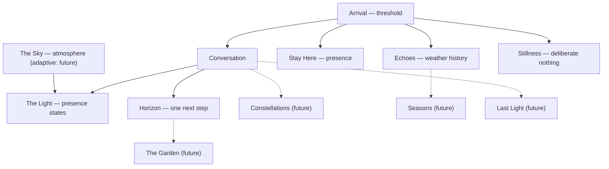

# Emotional Architecture

Saelis is a small world with weather. Each experience exists because a distinct emotional need
exists — none of it is decoration. This document maps the world and marks what is built versus
what is only imagined.

## The world

**The Sky** is the atmosphere everything lives in: the gradient, the clouds, the horizon glow.
Today it is a calm constant. _(Future: the Sky adapts gently to season and time of day — never to
surveilled mood.)_

**The Light** is Saelis's presence made visible. It rests, welcomes, listens, receives, reflects,
guides, celebrates, and is still. It is the emotional state of the companionship, honest about
being a lamp. **[Implemented]**

**Arrival** is the threshold — how today feels, in a few soft choices, so the first response can
meet the person where they are. **[Implemented]**

**Stay Here** is presence without action. Nothing to do, nothing measured. **[Implemented]**

**Horizon** holds what comes next — one manageable step resting in view. A direction, not a
backlog. **[Implemented]**

**Echoes** are the traces of past arrivals — personal weather history, kept only for the user.
**[Implemented]**

**Stillness** is deliberate nothing: a quiet stretch with a halo timer and no output. **[Implemented]**

## Future concepts (not implemented; do not build in this sprint)

- **The Sky as adaptive atmosphere** — seasonal and diurnal shifts in the celestial environment.
- **Constellations** — approved memories arranged as stars the user can see and touch (the visible
  form of the Memory Charter's Constellation class).
- **Seasons** — long-arc reflection: what this winter was like, what spring changed.
- **Quiet Days** — a gentle mode where Saelis deliberately recedes; presence at its minimum.
- **The Garden** — a place where completed steps and kept intentions grow into something visible,
  without scores.
- **Weather Within** — an optional, user-authored vocabulary for inner weather, never inferred.
- **Reflections** — occasional, opt-in looks backward drawn from Echoes.
- **Last Light** — the expanded ritual for meaningful goodbyes, building on today's closing lines.

## How the needs map

| Need                             | Experience                                     |
| -------------------------------- | ---------------------------------------------- |
| To cross a threshold gently      | Arrival                                        |
| To be accompanied, not used      | Stay Here                                      |
| To talk and be received          | Conversation + The Light                       |
| To see one way forward           | Horizon                                        |
| To see one's own weather         | Echoes                                         |
| To stop entirely                 | Stillness                                      |
| To be remembered only by consent | Constellations (future) / Memory Charter (now) |
| To end well                      | Closing lines → Last Light (future)            |

## Diagram

Solid lines exist today; dotted lines are future arcs. The invariant: every element serves a
distinct need, and removing its beauty would remove emotional room, not merely polish.
