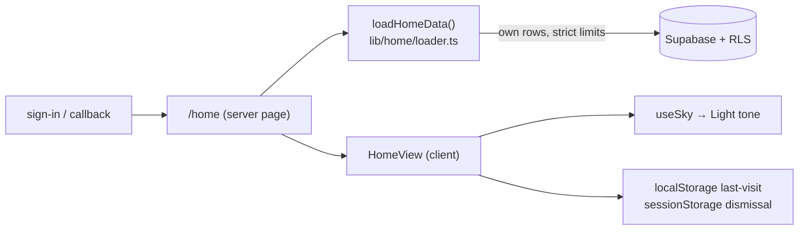

# Home Architecture

**Loader** (server, user-scoped, bounded): preferred name, privacy flags, horizon steps (active
count, completed-today count, one next step), approved-memory counts by kind, latest arrival
metadata (timestamp + support need — never the optional note), latest conversation timestamp
(existence only — never content). It cannot load unapproved/deleted memories, conversation text,
provider metadata, or telemetry. `selectContinuation` is a pure, tested priority function whose
outputs contain no private content.

**Client boundary** is one component (HomeView): greeting period and return context are computed
after mount (hydration-safe, mirroring the Living Sky), continuation dismissal is session-only,
and the sole timer is a single 4-second welcome settle. No client data fetches, no charts, no new
Sky mounts.

**Routing.** Sign-in, sign-up (with session), and the auth callback default now land on `/home`;
`/home` joined the protected prefixes; all previous deep links are unchanged. The public
marketing page remains public.

**Future extension points:** Last Light's full ritual replaces the groundwork line; Quiet Days
can soften the doors; Seasons can tint the greeting — all behind the same loader contract.
