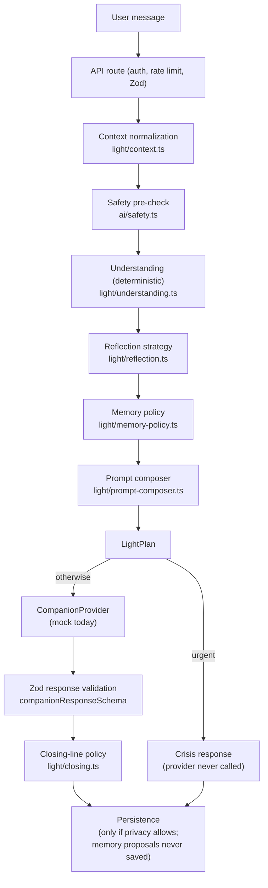

# Light Engine Architecture

The Light Engine (`src/lib/light/`) is the provider-independent behavioral layer between the
application and every AI provider. Saelis defines how the provider behaves; the provider never
defines Saelis. The engine is synchronous, deterministic, free of I/O, and free of provider SDKs.

```
User message
  → safety pre-check
  → context normalization
  → understanding
  → support-mode reflection
  → memory policy
  → prompt composition
  → provider
  → response validation
  → closing-line policy
  → persistence
```

## Diagram



## Stages

- **Input contract.** `LightContext` (`types.ts`): server-derived userId, message, capped recent
  turns, companion preferences, approved memories, optional latest arrival, privacy flags.
  Nothing else may enter the engine.
- **Safety pre-check.** The existing keyword pre-check (`src/lib/ai/safety.ts`) runs inside
  understanding. Urgent results override all routing. Its incompleteness is documented there and
  in safety-and-boundaries.md.
- **Understanding result.** Transparent ordered heuristics produce purpose, support mode,
  emotional tone, action readiness, confidence, cue names (never raw content), clarification
  need, and safety level. Explicit intent always beats inferred emotion.
- **Support mode selection.** Reflection (`reflection.ts`) converts understanding into a strategy:
  should we offer action, ask a question, offer presence, celebrate — and which Light state fits.
- **Memory policy.** `memory-policy.ts` decides whether approved memories may be supplied and
  whether one proposal may be offered. Blocks: memory disabled, any safety level, low confidence,
  duplicates, prohibited categories. The engine never persists anything.
- **Prompt composition.** `prompt-composer.ts` builds two compact strings: a developer
  instruction (constitution + voice + faith rule + output contract) and a contextual instruction
  (mode, goal, boundaries, arrival, permitted memories). No chain-of-thought is requested.
- **Provider interface.** `CompanionProvider.respond(input, plan?)` — providers receive the
  request and the plan. Provider implementations live outside `src/lib/light/` and never touch
  the database.
- **Response validation.** Every provider response is validated against
  `companionResponseSchema` before use. Invalid output → calm 502.
- **Closing-line policy.** `closing.ts` decides deterministically whether a moment concluded and
  selects a mode-appropriate line via a stable hash. Crisis responses are never closed poetically.
- **Persistence.** The API route persists turns only when the user allows history, and never
  persists a proposed memory. `lightState` is returned so the UI can set The Light.
- **Telemetry boundaries.** The engine emits nothing. Cue names are safe identifiers; raw content
  never appears in logs. No emotional scoring, no engagement tracking, no hidden profiling.
- **Failure behavior.** Empty message → `LightContextError` → 400 with calm copy. Provider error →
  calm 500/502; the user's message is never lost by the server.
- **Future streaming.** The plan is computed before the provider call, so a streaming provider can
  stream the `message` field while the validated envelope arrives at the end. The closing policy
  applies at stream completion.
- **Future provider switching.** `COMPANION_PROVIDER` selects the implementation. Because
  identity lives in the plan, switching vendors must not change Saelis's behavior — only its
  wording. Conformance is enforced by the same schema and constitution instruction.

## Invariants (tested)

1. The pipeline never calls a provider and never performs I/O.
2. Urgent safety bypasses the provider entirely.
3. Explicit vent/presence never yields steps; explicit step requests permit them.
4. No memory is proposed when disabled, in crisis, low-confidence, or duplicate.
5. Identical context → identical plan (full determinism).
6. Instructions prohibit — and never request — hidden reasoning.
