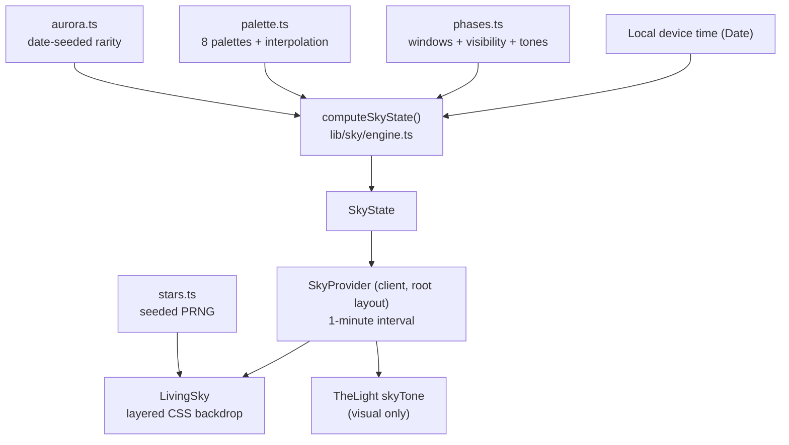

# Sky Engine Architecture

The Sky Engine (`src/lib/sky/`) is a pure, deterministic library: a `Date` in, a `SkyState` out.
No I/O, no location, no weather, no emotion, no message content — an intentionally tiny API so
privacy is provable by inspection.

## Modules

- **types.ts** — `SkyPhase`, `SkyPalette`, `SkyState`, `SkyStar`, `LightSkyTone`.
- **phases.ts** — phase windows (minutes since midnight, wraparound-safe), next-phase ordering,
  30-minute transition window, sun/moon/star visibility, star density, phase → Light tone map.
- **palette.ts** — one complete palette per phase; `lerpColor` (hex) and `interpolatePalette`
  (glass/text snap at the midpoint rather than blur).
- **stars.ts** — mulberry32 seeded PRNG; `generateStars(seed, count)` bounded to 90 (36 on
  mobile via CSS). No `Math.random()` at render time (tested).
- **aurora.ts** — `shouldShowAurora(seed, phase)`: night/twilight only, ~3%, stable per date.
- **engine.ts** — `computeSkyState(date, options)` plus `getInitialSkyState()` (fixed day-phase
  state for hydration-safe server rendering) and `dateSeed(date)`.
- **accessibility.ts** — media-preference read/observe helpers (reduced motion, contrast).

## Client integration

`SkyProvider` (the only new client boundary) mounts once in the root layout, renders `LivingSky`
plus the server-component children, computes state on mount and then on a 60-second interval —
never in animation frames — and exposes `{ state, reducedMotion, highContrast }` via context.
`useSky()` falls back to the stable default without a provider, keeping tests simple.

`LivingSky` is a fixed, `aria-hidden`, `pointer-events: none` backdrop at `z-index: -1` with the
layer order: base gradient → horizon glow → haze → far clouds → sun/moon → stars → aurora → mid
clouds → near mist. Palette values travel as CSS custom properties on the sky root; glass tint
and text overlay are mirrored to `:root` so surfaces adapt. Route changes never remount the sky
or reroll its seeds.

## Hydration and updates

The server renders `getInitialSkyState()` (a fixed day sky); the client recomputes from local
time after mount, so first paint matches exactly and the correction is a soft palette shift.
Because interpolation progresses in tiny per-minute steps across 30-minute windows, no CSS
transitions are needed and no flashes occur.

## Performance constraints

CSS gradients and transforms only (no Canvas, no SVG filters); animations touch transform and
opacity exclusively; three blur layers maximum per band; stars memoized; one state update per
minute; under 480px the far cloud band is dropped, blur is reduced, and stars are capped at 36.
No measured frame-rate claims are made.

## Extension points

Future milestones can consume `SkyState` for adaptive atmosphere (Seasons), place approved
memories among `generateStars` coordinates (Constellations), and add an opt-in location provider
that feeds real sunrise/sunset times into `phases.ts` — all without changing the engine's shape.
